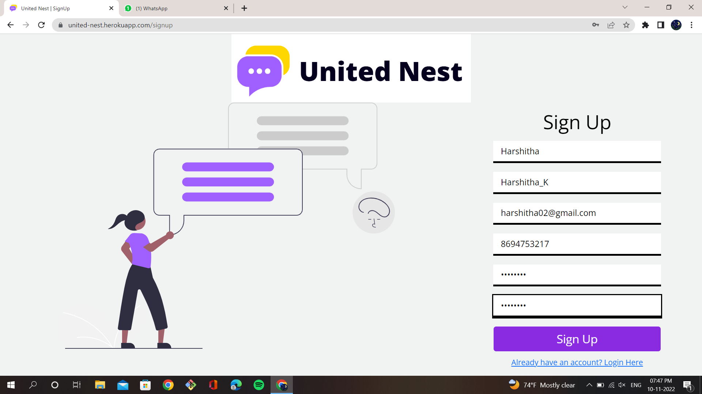
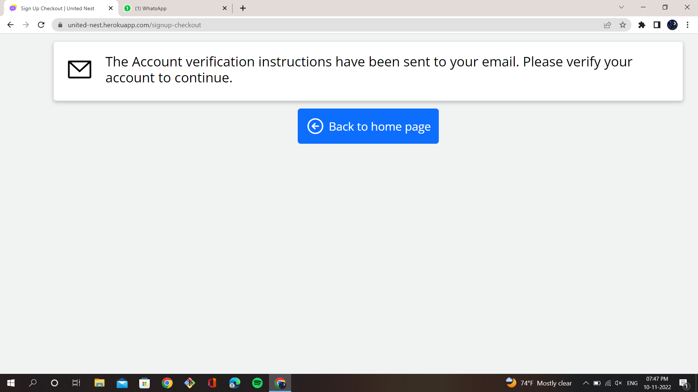
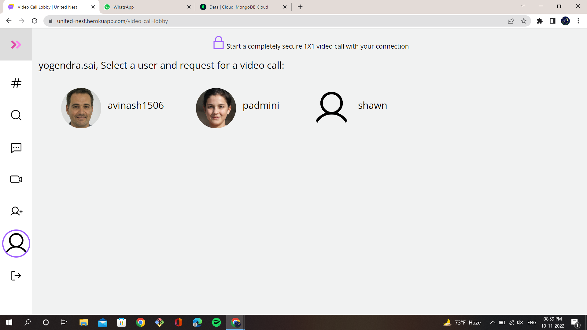
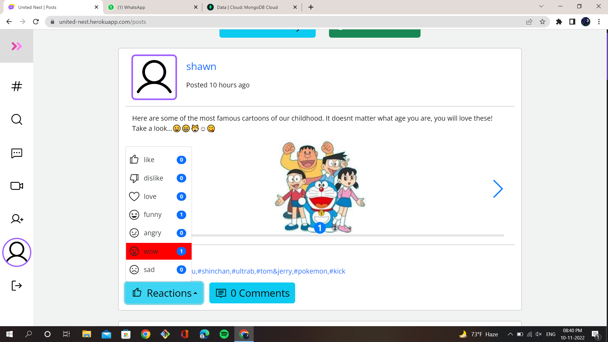

# United-Nest
A Social Media Application make using Node.js, Express, MongoDB, PUG Template Engine, HTML, CSS and JavaScript; as part of Academic Mini Project.

👉 Application deployed at Heroku: https://united-nest.herokuapp.com/ 
(The link might not work once Heroku removes their free tier. We might deploy this application on an alternative hosting platform, but, nevertheless, we have added the **application screenshots** in this readme file😁)

> Open the **`instructions.md`** file to view the steps required to run the app locally.

# 💥Highlights💥
- Single User Chat & Group Chat (Using **socket.io**)
- Video Call between two users (Using **Twilio Video API** ontop of WebRTC)
- Toxic text detection in post's text (**Tensorflow.js**'s inbuilt model)
- NSFW Image detection in post's image upload (**SightEngine**'s Image Moderation API)
- Followers, Following feature as in Instagram
- Pagination for showing posts
- Sign Up Verification via emails
- Password reset emails
- Rate Limiting Mechanism to prevent Brute Force attacks
- Data Sanitization to prevent XSS attacks & Query Injection

# 📷Application Screenshots📷

### User Account Creation & Verification
<figure>
    
    <figcaption align="center"><strong>1.1. User signup page</strong></figcaption>
</figure>

<figure>
    
    <figcaption align="center"><strong>1.2. Signup checkout page</strong></figcaption>
</figure>

<figure>
    
    <figcaption align="center"><strong>1.3. Account Verification Email</strong></figcaption>
</figure>

### Login
<figure>
    
    <figcaption align="center"><strong>2.1. Login Page</strong></figcaption>
</figure>

### View posts
<figure>
    
    <figcaption align="center"><strong>3.1. View Posts</strong></figcaption>
</figure>

### Adding new posts
<figure>
    
    <figcaption align="center"><strong>4.1. Adding a normal post</strong></figcaption>
</figure>

<figure>
    
    <figcaption align="center"><strong>4.2. Trying to add a post containing toxic text</strong></figcaption>
</figure>

<figure>
    
    <figcaption align="center"><strong>4.3. Trying to add a post containing weapons (we consider NSFW as weapons, alcohol, drugs, gore, violent, offensive, hate, nudity)</strong></figcaption>
</figure>

> **👉NOTE:** Only the mutual connections of a user will be able to view the posts posted by the user.
> 
> **👉NOTE:** For both chatting and video call, a user can only do so with their mutual connections.

### Chatting Feature
<figure>
    
    <figcaption align="center"><strong>5.1. Chatting module home page</strong></figcaption>
</figure>

<figure>
    
    <figcaption align="center"><strong>5.2. Chatting with a single user</strong></figcaption>
</figure>

<figure>
    
    <figcaption align="center"><strong>5.3. Creating a group</strong></figcaption>
</figure>

<figure>
    
    <figcaption align="center"><strong>5.4. Typing a message in a group chat</strong></figcaption>
</figure>

<figure>
    
    <figcaption align="center"><strong>5.5. Sending a message in group chat</strong></figcaption>
</figure>

### Video call feature
<figure>
    
    <figcaption align="center"><strong>6.1. Video Call lobby</strong></figcaption>
</figure>

<figure>
    
    <figcaption align="center"><strong>6.2. Video Call demo</strong></figcaption>
</figure>

### Forgot Password
<figure>
    
    <figcaption align="center"><strong>7.1. Forgot Password page</strong></figcaption>
</figure>

<figure>
    
    <figcaption align="center"><strong>7.2. Reset Password Email</strong></figcaption>
</figure>

<figure>
    
    <figcaption align="center"><strong>7.3. Reset Password page</strong></figcaption>
</figure>

### User profile
<figure>
    
    <figcaption align="center"><strong>8.1. User Profile page</strong></figcaption>
</figure>

### View Followers & Following
<figure>
    
    <figcaption align="center"><strong>9.1. View Followers (Who are following us)</strong></figcaption>
</figure>

<figure>
    
    <figcaption align="center"><strong>9.2. View Following (Whom we are following)</strong></figcaption>
</figure>

### Search by posts
<figure>
    
    <figcaption align="center"><strong>10.1. Search by posts</strong></figcaption>
</figure>

### Search by users
<figure>
    
    <figcaption align="center"><strong>11.1. Search by user</strong></figcaption>
</figure>

### React to post
<figure>
    
    <figcaption align="center"><strong>12.1. React to post</strong></figcaption>
</figure>

### Comments on a post
<figure>
    
    <figcaption align="center"><strong>13.1. Comment on a post</strong></figcaption>
</figure>

<figure>
    
    <figcaption align="center"><strong>13.2. View comments on a post</strong></figcaption>
</figure>
